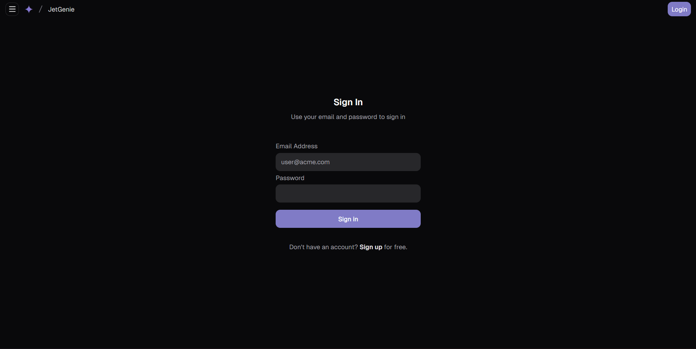
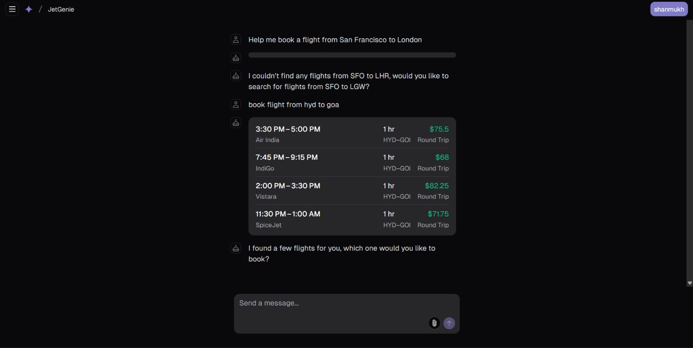
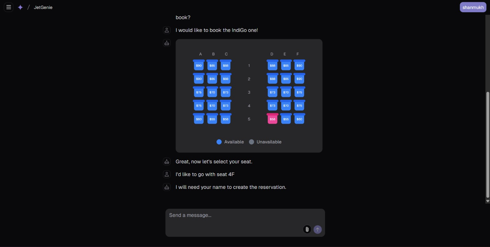
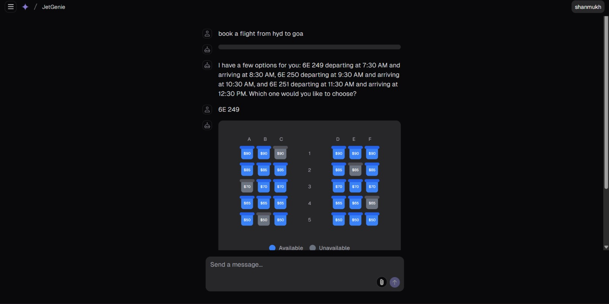
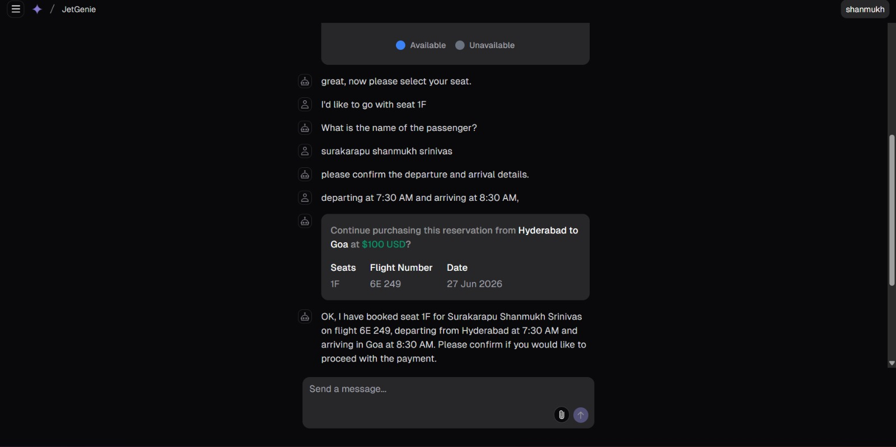
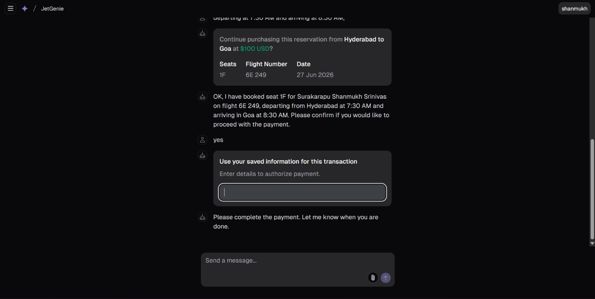
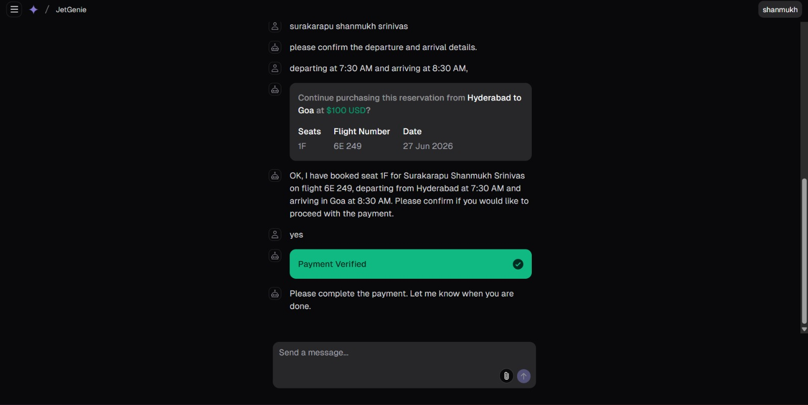
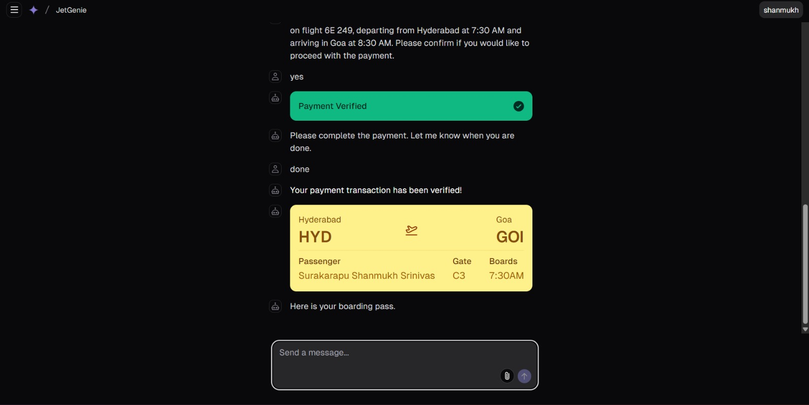

# JetGeine ✈️  
### An Automated Flight Ticket Booking Platform Built With Next.js and the AI SDK

JetGeine is an AI-powered flight booking platform designed to simplify the travel search and reservation experience. Built on a modern Next.js template, it combines intelligent conversation, streamlined booking workflows, secure authentication, and persistent user data to help users discover and reserve flights faster.

---

## 📸 Screenshots

### Signin Page


### Flight Search Interface


### Booking Flow




### Confirmation


### Payment Details


### Payment Verification


###  Boarding Pass

---

## ✨ Features

- **AI-Powered Flight Assistance**  
  Search, compare, and guide users through flight booking using natural language.

- **Automated Booking Workflow**  
  Reduces manual effort by streamlining the journey from search to reservation.

- **Modern App Router Architecture**  
  Built with the Next.js App Router for fast navigation and scalable routing.

- **React Server Components & Server Actions**  
  Improves performance and enables cleaner server-side interactions.

- **Unified AI SDK Integration**  
  Supports text generation, structured outputs, and tool calls for intelligent travel experiences.

- **Multiple Model Providers**  
  Compatible with Google Gemini, OpenAI, Anthropic, Cohere, and more.

- **Beautiful UI with shadcn/ui**  
  Accessible, elegant components styled with Tailwind CSS.

- **Secure Authentication**  
  Powered by NextAuth.js for safe login and session management.

- **Persistent Data Storage**  
  Uses Vercel Postgres powered by Neon for user data, booking history, and saved preferences.

- **Blob Storage Support**  
  Uses Vercel Blob for efficient file and asset storage.

- **Deployment Ready**  
  Can be deployed to Vercel with minimal setup.

---

# 🚀 Getting Started

Get JetGeine running locally in just a few minutes.

## Prerequisites

Before you begin, make sure you have the following installed:

* **Node.js** `v18` or later
* **pnpm** *(recommended)*, npm, or Yarn
* **Git**
* **Vercel CLI** *(optional, recommended for environment management)*

---

## 📥 Clone the Repository

```bash
git clone https://github.com/shanmuckh/JetGenie.git
cd jetgeine
```

---

## 📦 Install Dependencies

Using pnpm (recommended):

```bash
pnpm install
```

Or using npm:

```bash
npm install
```

Or using Yarn:

```bash
yarn install
```

---

## ⚙️ Configure Environment Variables

Create a new `.env.local` file in the project root.

You can copy the provided template:

```bash
cp .env.example .env.local
```

Fill in your credentials:

```env
# AI Providers
GOOGLE_GENERATIVE_AI_API_KEY=
OPENAI_API_KEY=
ANTHROPIC_API_KEY=
COHERE_API_KEY=

# Authentication
AUTH_SECRET=
AUTH_URL=

# Database
POSTGRES_URL=
POSTGRES_PRISMA_URL=
POSTGRES_URL_NON_POOLING=

# Object Storage
BLOB_READ_WRITE_TOKEN=
```
---

## ▶ Start the Development Server

```bash
pnpm dev
```

Visit:

```
http://localhost:3000
```

The application will automatically reload whenever you make changes.

---

# 🧠 AI Model Providers

JetGeine is powered by the **Vercel AI SDK**, making it easy to switch between leading Large Language Models without changing your application architecture.

Supported providers include:

* ✅ Google Gemini *(Default)*
* ✅ OpenAI
* ✅ Anthropic
* ✅ Cohere
* ✅ Groq
* ✅ xAI
* ✅ Together AI
* ✅ Mistral AI
* ✅ Any AI SDK-compatible provider

Switching providers typically requires only updating your API key and model configuration.

---

# 🔐 Authentication

JetGeine uses **NextAuth.js** to provide enterprise-grade authentication.

Features include:

* Secure Sign-In
* Protected Routes
* Session Management
* OAuth Support
* Persistent User Sessions
* User-specific Booking History
* Role-based Access *(optional)*

---

# 🗄️ Data Persistence

JetGeine stores user and booking data using modern cloud-native services.

### 🛢️ Vercel Postgres (Powered by Neon)

Used for:

* User Accounts
* Booking Records
* Flight Search History
* Saved Trips
* Travel Preferences
* Session Metadata

---

### ☁️ Vercel Blob Storage

Used for:

* Uploaded Assets
* User Files
* Media Storage
* Static Objects
* Travel Documents

---

# 🏗️ Architecture

```
                 ┌────────────────────┐
                 │      Next.js        │
                 └─────────┬───────────┘
                           │
          ┌────────────────┼────────────────┐
          │                │                │
          ▼                ▼                ▼
    AI SDK Layer      NextAuth.js     Server Actions
          │                │                │
          ▼                ▼                ▼
 Google Gemini      User Sessions     Booking Logic
          │
          ▼
  Vercel Postgres + Blob Storage
```

---

# 💻 Development Scripts

| Command           | 
| ----------------- | 
| `pnpm dev`        | 
| `pnpm build`      | 
| `pnpm start`      | 
| `pnpm lint`       | 
| `pnpm format`     | 
| `pnpm type-check` | 

---


---


